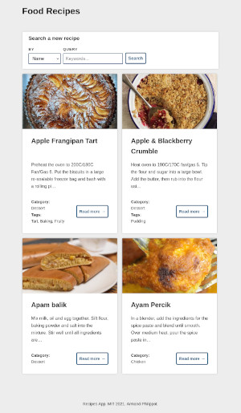

# Angular Recipes

A recipes app implemented with Angular.

## How to

### Start the development version

1. Run `pnpm start`
2. Navigate to `http://localhost:4200/` (browser normally opens automatically).

### Start the build version

1. Run `pnpm build` to build the project
2. `pnpm serve -s dist/recipes`

## Preview

## License

This project is open-source and available under the [MIT License](../LICENSE).
