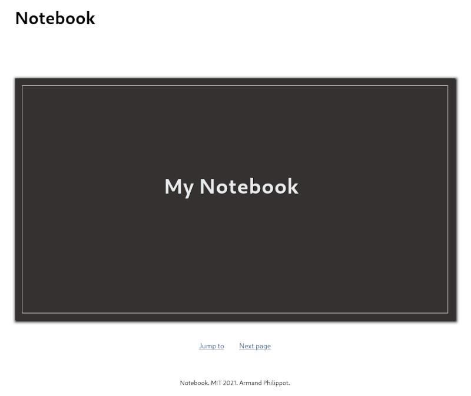
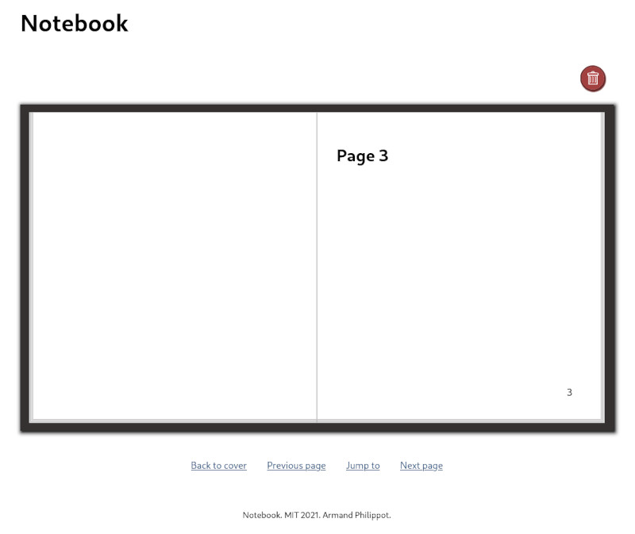

# React Notebook

A notebook implementation with React.

## How to

### Start the development version

`pnpm start`

### Start the build version:

1. `pnpm build`
2. `pnpm serve -s build` (or `BUILD_PATH` if set)

## Previews

| Cover                                        | Page                                       |
| -------------------------------------------- | ------------------------------------------ |
|  |  |

## License

This project is open source and available under the [MIT license](../LICENSE).
