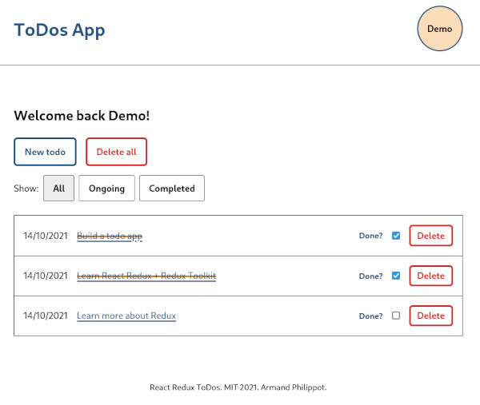
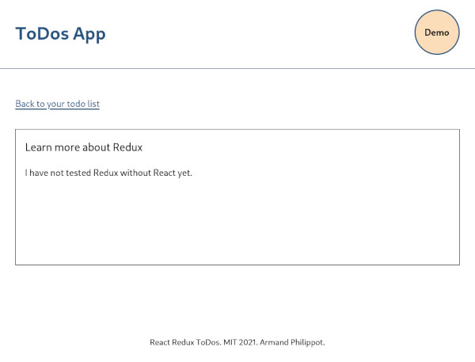
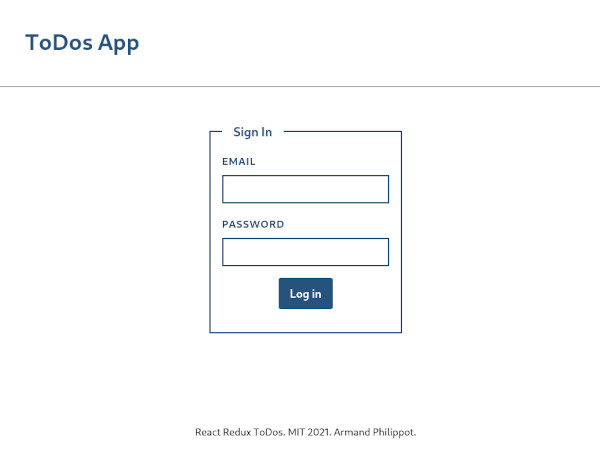
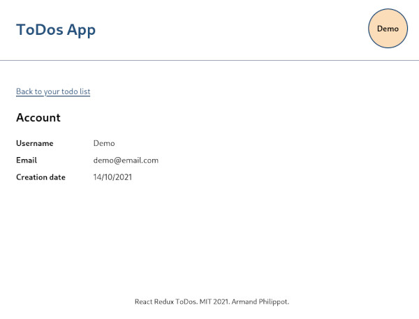

# React Redux ToDos

A ToDo app implementation with React and Redux.

## Description

This a simple ToDo application used to learn Redux.

The app has different views:

- login (and a logout link)
- a todos list where user can add new todos and mark them as done
- a single todo view where user can see todo details and edit data
- an account view

## How to

### Start the development version

`pnpm start`

### Start the build version:

1. `pnpm build`
2. `pnpm serve -s build` (or `BUILD_PATH` if set)

## Login

User: `demo@email.com`

Password: `demo`

## Preview

| Todos list                                       | Single todo                                       |
| ------------------------------------------------ | ------------------------------------------------- |
|  |  |

| Login Page                                        | Account Page                                          |
| ------------------------------------------------- | ----------------------------------------------------- |
|  |  |

## Disclaimer

This app is not intended to be used. There is no registration form and password encryption is not implemented. The only user available is a demo user.

## License

This project is open-source and available under [MIT license](../LICENSE).
